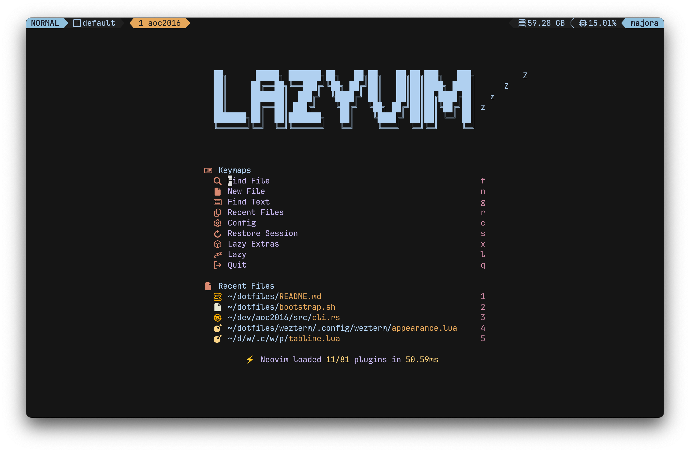
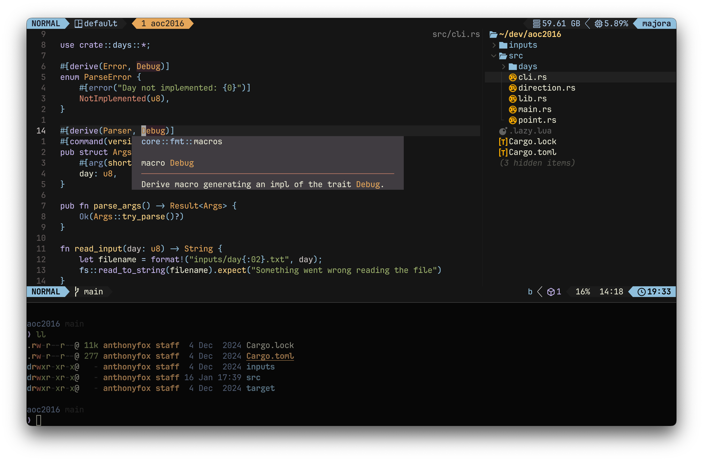
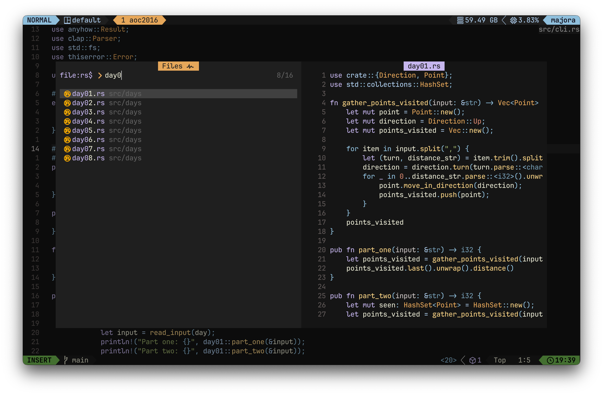

## Overview

This repository contains my personal configuration for all the tools and applications I use in my day-to-day development work. It includes configurations for various applications, a collection of useful aliases and functions, custom fonts, and Dockerfiles for creating development containers.

**Note:** that this repo changes often and provides no guarantee of stability. It is intended for my personal use, but feel free to use it as a reference or for inspiration.

## Contents

- **Configuration Files:** Settings for my most-used applications.
- **Aliases:** Shortcuts for common command-line operations.
- **Functions:** Useful functions for enhanced command-line productivity.
- **Fonts:** Custom fonts that I've found to be great for coding.
- **Dockerfiles:** Ready-to-use Dockerfiles for setting up development environments.

## Instructions

```bash
$ git clone https://github.com/wtfox/dotfiles.git ~/dotfiles/ && cd ~/dotfiles/
$ ./bootstrap.sh
```

## Screenshots




