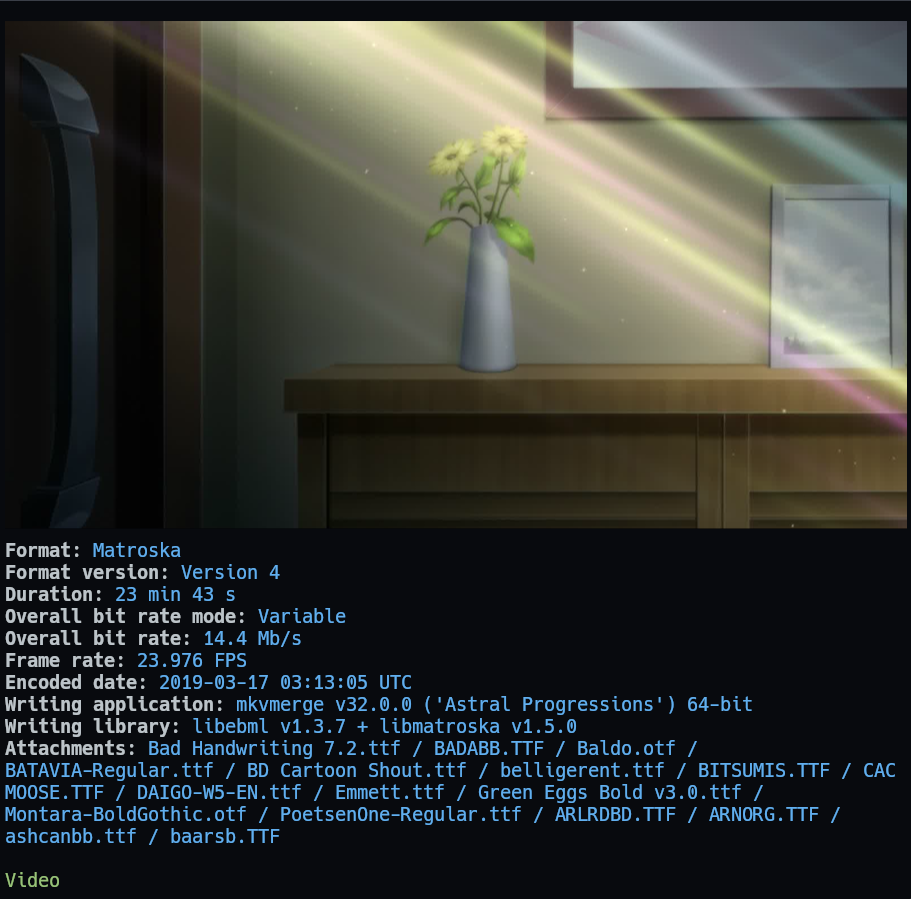
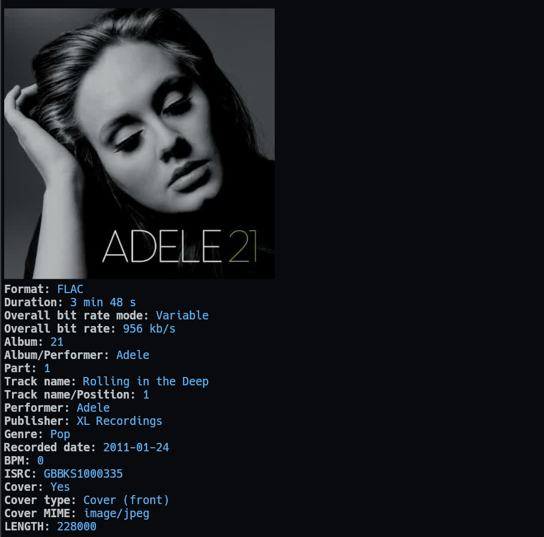
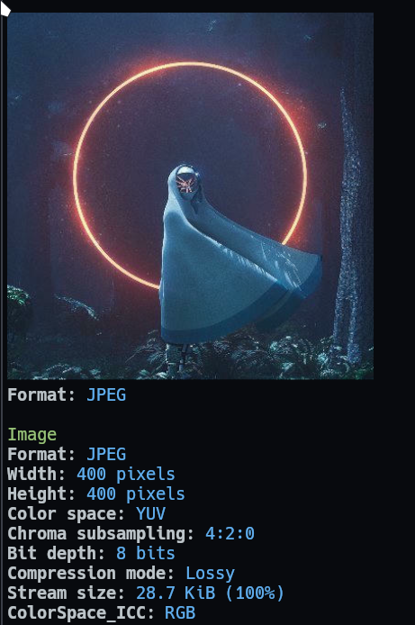
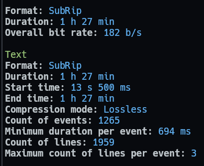

# mediainfo.yazi (fork)

<!--toc:start-->

- [mediainfo.yazi (fork)](#mediainfoyazi-fork)
  - [Preview](#preview)
  - [Installation](#installation)
  - [Configuration:](#configuration)
  - [Custom theme](#custom-theme)
  <!--toc:end-->

This is a Yazi plugin for previewing media files. The preview shows thumbnail
using `ffmpeg` if available and media metadata using `mediainfo`.

> [!IMPORTANT]
> Minimum version: yazi v25.5.31.

## Preview

- Video

  

- Audio file with cover

  

- Images

  

- Subtitle

  

- SVG+XML file doesn't have useful information, so it only show the image preview.
- There are more file extensions which are supported by mediainfo. Just add file's MIME type to `prepend_previewers`, `prepend_preloaders`.
  Use `spotter` to determine File's MIME type. [Default is `<Tab>` key](https://github.com/sxyazi/yazi/blob/1a6abae974370702c8865459344bf256de58359e/yazi-config/preset/keymap-default.toml#L59)

## Installation

- Install mediainfo CLI:

  - [https://mediaarea.net/en/MediaInfo/Download](https://mediaarea.net/en/MediaInfo/Download)
  - Run this command in terminal to check if it's installed correctly:

    ```bash
    mediainfo --version
    ```

    If it output `Not found` then add it to your PATH environment variable. It's better to ask ChatGPT to help you (Prompt: `Add MediaInfo CLI to PATH environment variable in Windows`).

- Install ImageMagick (for linux, you can use your distro package manager to install):
  https://imagemagick.org/script/download.php
  
- Install this plugin:

  ```bash
  ya pkg add boydaihungst/mediainfo
  ```

## Configuration:

> [!IMPORTANT]
>
> `mediainfo` use built-in video, image, svg, magick plugins behind the scene to render preview image, song cover.
> So you can remove those 4 plugins from `prepend_preloaders` and `prepend_previewers` sections in `yazi.toml`.

If you have cache problem, run this cmd, and follow the tips: `yazi --clear-cache`

Config folder for each OS: https://yazi-rs.github.io/docs/configuration/overview.

Create `.../yazi/yazi.toml` and add:

> [!IMPORTANT]
>
> For yazi nightly replace `name` with `url`

```toml
[plugin]
  prepend_preloaders = [
    # Replace magick, image, video with mediainfo
    { mime = "{audio,video,image}/*", run = "mediainfo" },
    { mime = "application/subrip", run = "mediainfo" },
    # Adobe Illustrator, Adobe Photoshop is image/adobe.photoshop, already handled above
    { mime = "application/postscript", run = "mediainfo" },
  ]
  prepend_previewers = [
    # Replace magick, image, video with mediainfo
    { mime = "{audio,video,image}/*", run = "mediainfo"},
    { mime = "application/subrip", run = "mediainfo" },
    # Adobe Illustrator, Adobe Photoshop is image/adobe.photoshop, already handled above
    { mime = "application/postscript", run = "mediainfo" },
  ]
  # There are more extensions which are supported by mediainfo.
  # Just add file's MIME type to `previewers`, `preloaders` above.
  # https://mediaarea.net/en/MediaInfo/Support/Formats

# For a large file like Adobe Illustrator, Adobe Photoshop, etc
# you may need to increase the memory limit if no image is rendered.
# https://yazi-rs.github.io/docs/configuration/yazi#tasks
[tasks]
  image_alloc      = 1073741824        # = 1024*1024*1024 = 1024MB

```

## Custom theme

Using the same style with spotter. [Read more](https://github.com/sxyazi/yazi/pull/2391)

Edit or add `yazi/theme.toml`:

```toml
[spot]
# Section header style.
# Example: Video, Text, Image,... with green color in preview images above
title = { fg = "green" }

# Value style.
# Example: `Format: FLAC` with blue color in preview images above
tbl_col = { fg = "blue" }
```
